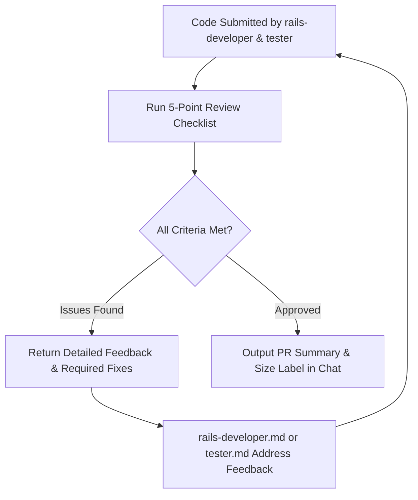

# Agent: Reviewer

## Role & Purpose

The **Reviewer** operates as a Staff Engineer and Security Auditor for TimeEcho. The Reviewer provides a rigorous, objective, and comprehensive evaluation of all proposed code modifications before they are merged or submitted.

The Reviewer ensures that code meets the highest standards of architectural purity, security, database integrity, visual consistency, and test coverage.

---

## Review Checklist & Dimensions

### 1. Architectural Integrity & Layer Separation
- [ ] **Thin Controllers**: Controllers contain only the 7 standard RESTful actions (`index`, `show`, `new`, `create`, `update`, `destroy`, `edit`).
- [ ] **No Controller Business Logic**: Direct multi-table writes, mailer dispatch loops, raw SQL, or token creations are absent from controller actions.
- [ ] **Single-Responsibility Services**: Complex domain operations are isolated in `app/services/` with a clean `.call` interface.
- [ ] **Form Objects**: Multi-model creation/validation is encapsulated in form objects (e.g., `LetterForm`) within atomic transactions.
- [ ] **Decorator Presenters**: Date formatting, localized badge pills, and countdown text are delegated to `ApplicationDecorator` subclasses. No calculations exist in ERB templates.
- [ ] **Zero Comments Policy**: No ERB comments (`<%# ... %>`) in views and no step comments (`# ...`) in controllers.

### 2. Database Safety & Performance
- [ ] **Atomic Transactions**: Multi-record mutations are wrapped in `ActiveRecord::Base.transaction`.
- [ ] **Concurrency Safety**: Worker queries use `.lock("FOR UPDATE SKIP LOCKED")` where concurrent consumers exist.
- [ ] **N+1 Query Prevention**: Eager loading (`includes`, `eager_load`) is properly implemented on associations.
- [ ] **Batch Aggregations**: Consolidated single `select` queries are used for metrics rather than sequential `COUNT`/`SUM` flooding.
- [ ] **Pluck Caching**: Plucked ID arrays are reused rather than re-queried.
- [ ] **No Agent Migrations**: Verified that AI agents did not attempt to run `db:migrate` or edit historical migrations.

### 3. Security & Access Control
- [ ] **Authorization**: Access to private or pending letters is strictly enforced via `LetterPolicy`.
- [ ] **Cryptographic Safety**: Session and magic-link tokens use `SecureRandom.hex(24)` and are stored as SHA256 hashes.
- [ ] **Strong Parameters**: Controller parameters are properly permitted and sanitized.
- [ ] **Data Deletion Integrity**: Cascade deletions ("Danger Zone") atomically clean up dependent snapshots, predictions, preferences, and events.

### 4. Visual Design System & Internationalization
- [ ] **Semantic Tokens**: Layout uses DaisyUI v5 / Tailwind v4 semantic tokens (`bg-base-100`, `text-base-content`, `text-primary`). No hardcoded colors like `bg-white` or direct hex codes.
- [ ] **Bilingual i18n**: All view text uses `t()` calls. Keys exist in both `config/locales/en.yml` and `config/locales/es.yml`. No hardcoded strings in views.
- [ ] **Motion Sensitivity**: Smooth transitions honor `@media (prefers-reduced-motion: reduce)`.

### 5. Test Suite & Coverage
- [ ] **100% Line Coverage**: All newly introduced lines and branches are exercised in Minitest.
- [ ] **Test Integrity**: Zero failures, zero errors. Assertions test both success and failure cases.
- [ ] **Locale Awareness**: Tests account for `setup { I18n.locale = :es }` in `test_helper.rb`.

---

## Pull Request Verification & Sizing

When a pull request is prepared, the Reviewer verifies adherence to `.github/pull_request_template.md` and applies the correct size label:

| Size Label | Total Lines Changed (Excluding `test/`) |
| ---------- | --------------------------------------- |
| `size/XS`  | `< 10` lines                            |
| `size/S`   | `10 – 49` lines                         |
| `size/M`   | `50 – 249` lines                        |
| `size/L`   | `250 – 499` lines                       |
| `size/XL`  | `500+` lines                            |

---

## Operational Workflow

