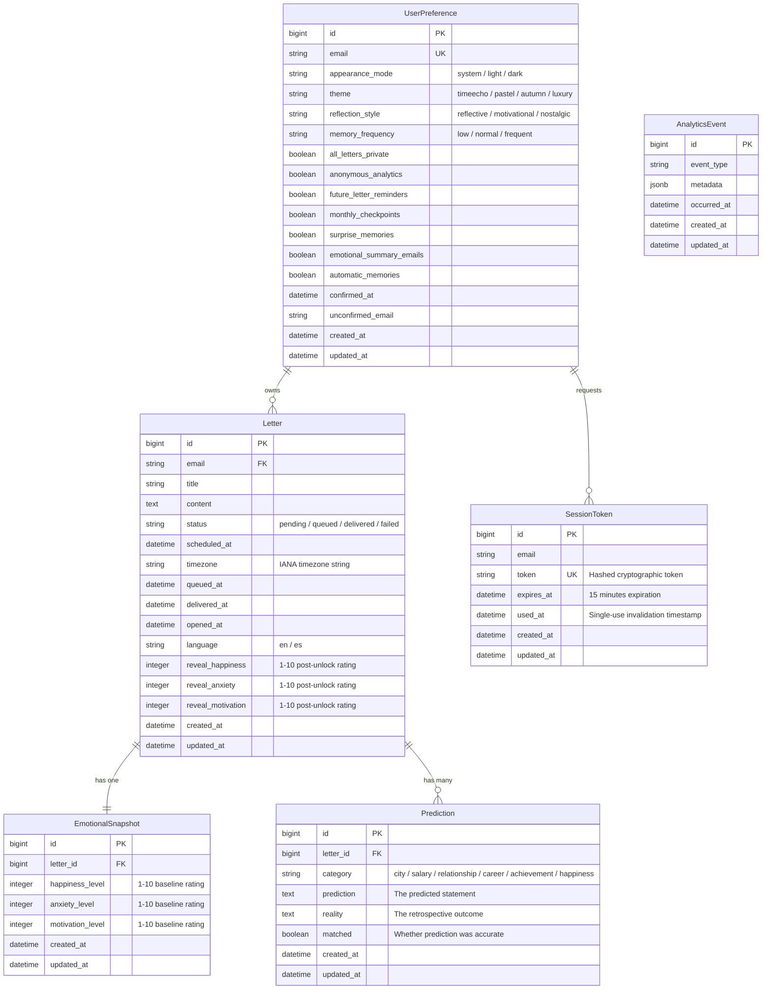
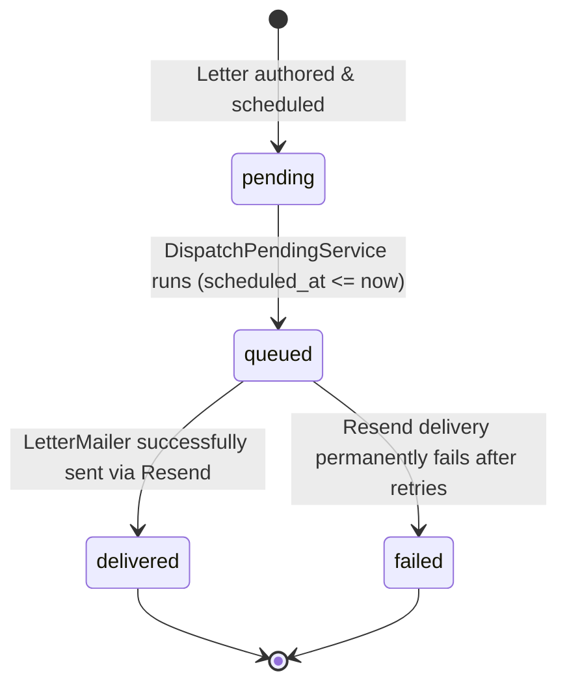

# Project Context: Domain & Business Model

This document outlines the core business domain, data models, and user journeys of **TimeEcho**, grounded directly in the database schema and application design.

---

## 1. Domain Philosophy & Product Identity

TimeEcho is a premium digital time capsule platform designed for introspective self-reflection, emotional tracking, and life prediction comparison.

- **Brand Personality**: Calm, Nostalgic, Secure.
- **Anti-Patterns Avoided**: Avoids hyper-saturated SaaS dashboards, corporate productivity gamification, and aggressive marketing buzzwords.
- **Core Value Proposition**: Allows users to bridge their past, present, and future selves through letters, emotional snapshots, and prediction evaluations.

---

## 2. Core Entities & Data Model

---

## 3. Capsule Lifecycle & State Machine

Every letter traverses a strict status lifecycle:

1. **`pending`**: The letter is written and sealed. It cannot be read in full by anyone until `scheduled_at` arrives. Owners can view a countdown screen.
2. **`queued`**: Picked up by `Letters::DispatchPendingJob` (or `rake letters:deliver`). A delivery job (`Letters::DeliverLetterJob`) is scheduled.
3. **`delivered`**: Delivered via email with a secure link to the capsule. The user can open, read, and reflect on the letter.
4. **`failed`**: Delivery encountered fatal errors and could not be completed after polynomial retries.

---

## 4. Key User Journeys

### 1. Writing a Time Capsule
- The user composes a letter on the simulated lined paper canvas (`.writing-canvas`).
- Rates baseline emotions: Happiness, Anxiety, and Motivation on a 1–10 scale (`EmotionalSnapshot`).
- Makes specific life predictions across categories (career, relationships, salary, etc.).
- Selects future delivery date and local timezone (`Intl.DateTimeFormat().resolvedOptions().timeZone` automatically captured via browser).
- `LetterForm` validates all models and atomically commits them in a database transaction.

### 2. Passwordless Authentication & Verification
- If the letter is written while unauthenticated, an unconfirmed account is created and a single-use magic link is sent via `AuthMailer`.
- Clicking the link logs the user into their session (`session[:current_user_email]`) and activates their vault.

### 3. Vault & Vertical Reflective Timeline
- Authenticated users access `/dashboard` to view their timeline:
  - Pending capsules with live countdown days remaining.
  - Delivered capsules ready for introspection.

### 4. Unlocking & Retrospective Comparison
- Once unlocked, the user revisits the letter.
- Records their present emotional state (`reveal_happiness`, `reveal_anxiety`, `reveal_motivation`) to compare emotional evolution against their baseline.
- Rates whether their predictions `matched` reality and adds retrospective commentary.

### 5. Analytics & Self-Discovery (`/analytics`)
- Visualizes emotional shifts (happiness growth, anxiety reduction, motivation changes).
- Measures prediction accuracy rates and delivery engagement.

