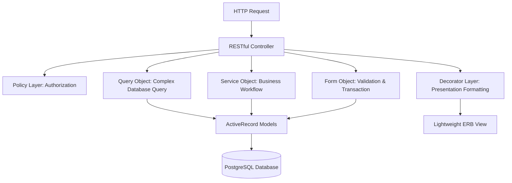

# Engineering Rules: Architecture & Design Patterns

TimeEcho adheres to a strict single-responsibility, layered architectural pattern. This architecture decouples business logic, data presentation, complex database queries, multi-model validation, and access control from core models and controllers.

---

## Architectural Layers Overview

---

## 1. Controllers (`app/controllers/`)

- **Role**: Thin HTTP orchestration layer.
- **Rules**:
  - Only use the 7 standard RESTful actions (`index`, `show`, `new`, `create`, `update`, `destroy`, `edit`).
  - Never call `.transaction`, run raw SQL, or manipulate multiple database records directly inside a controller.
  - Offload business operations to a Service Object or Form Object.
  - Offload query building with complex joins/locks to a Query Object.
  - Zero comments policy: No `# ...` step comments in controllers.

---

## 2. Form Objects (`app/forms/`)

- **Role**: Multi-model validation and atomic transactional synchronization.
- **Rules**:
  - Inherit from `ActiveModel::Model` or include `ActiveModel::Attributes`.
  - Validate nested child attributes before initiating database operations.
  - Encapsulate `ActiveRecord::Base.transaction` blocks so that creation of parent and children entities (e.g., `Letter` + `EmotionalSnapshot` + multiple `Prediction` records in `LetterForm`) succeed or roll back atomically.
  - Expose a clean `.save` or `.submit` boolean method returning errors via standard Rails `errors` object.

---

## 3. Service Objects (`app/services/`)

- **Role**: Encapsulate single business actions.
- **Rules**:
  - Namespace services under their business domain (`Letters::`, `Auth::`, `Analytics::`, `Settings::`).
  - Expose a single public entry point: `self.call(...)` or `call`.
  - Do not introduce multi-action services (e.g., avoid `LetterManagerService` with 10 public methods).
  - Return clear result objects, models, or boolean statuses.
  - Examples in codebase:
    - `Letters::CreateService`: Persists validated letter and triggers confirmation if unauthenticated.
    - `Letters::DeliverService`: Transitions capsule status to delivered/failed and dispatches mailer.
    - `Letters::DispatchPendingService`: Queries due letters and enqueues background deliver jobs.
    - `Auth::MagicLinkService`: Creates, sends, and authenticates cryptographically secure session tokens.

---

## 4. Decorators / Presenters (`app/decorators/`)

- **Role**: View presentation logic and localized formatting.
- **Rules**:
  - All decorators extend `ApplicationDecorator`, which wraps the model via Ruby's native `SimpleDelegator`.
  - Never perform date calculations, localized string mappings, badge color selection, or countdown math in ERB views.
  - Decorators format dates using `I18n.l(date, format: :long)` and take timezones into account (`letter.local_scheduled_at`).
  - Decorators handle dynamic title translations (e.g., `LetterDecorator#display_title`).
  - Collections are decorated via class methods: `LetterDecorator.decorate(letters)`.

---

## 5. Query Objects (`app/queries/`)

- **Role**: Isolate complex ActiveRecord queries from controllers and models.
- **Rules**:
  - Return an `ActiveRecord::Relation` where chaining is appropriate.
  - Encapsulate eager-loading (`includes`, `eager_load`) to prevent $N+1$ queries (e.g., `UserTimelineQuery`).
  - Encapsulate database row-level locking (e.g., `lock("FOR UPDATE SKIP LOCKED")` in `PendingLettersQuery`).

---

## 6. Policy Layer (`app/policies/`)

- **Role**: Declarative authorization.
- **Rules**:
  - Separate access logic from controllers and models.
  - Explicitly define authorization rules:
    - Letters are strictly private digital capsules locked to their creator (`user_email.present? && letter.email == user_email`).

---

## 7. Views & Zero Comments Policy (`app/views/`)

- **Rules**:
  - Views must remain lightweight, declarative, and semantic.
  - **No ERB comments** (`<%# ... %>`) or visual layout dividers inside view templates.
  - **No hardcoded text**: All user-facing strings must use `t('key')`.
  - Use DaisyUI v5 semantic components and theme tokens (`bg-base-100`, `text-primary`).

