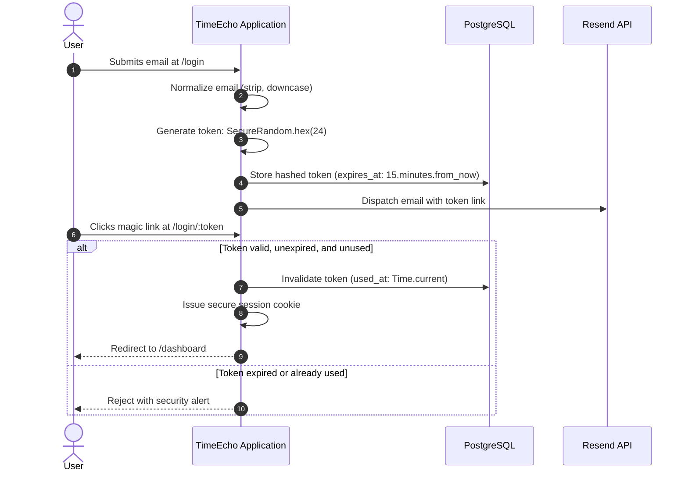

# Engineering Rules: Security & Privacy

Security and user privacy are foundational to TimeEcho's brand identity ("Calm, Nostalgic, Secure"). Because TimeEcho stores deeply personal letters, emotional reflections, and future life predictions, the application enforces strict security controls across all architectural layers.

---

## 1. Passwordless Magic Link Security

TimeEcho eliminates password-related vulnerabilities (credential stuffing, weak passwords, rainbow table attacks) through a passwordless token lifecycle:



### Magic Link Rules:
1. **Cryptographic Randomness**: Tokens must always be generated via `SecureRandom.hex(24)` or greater.
2. **Short Time-to-Live**: Magic links expire in **15 minutes**.
3. **Strict Single-Use**: Tokens must be marked with `used_at = Time.current` upon first redemption. Any replay attempt must be rejected.
4. **Automated Purging**: Stale and expired tokens are cleaned up hourly via `CleanupExpiredTokensJob`.

---

## 2. Authorization & Policy Controls (`LetterPolicy`)

- **Ownership Enforcement**: Access to private or pending letters must be gated through `LetterPolicy`:
  ```ruby
  # app/policies/letter_policy.rb
  class LetterPolicy
    attr_reader :user_email, :letter

    def initialize(user_email, letter)
      @user_email = user_email
      @letter = letter
    end

    def show?
      user_email.present? && letter.email == user_email
    end
  end
  ```
- **Capsule Access Isolation**:
  - Letters with any status (`pending`, `queued`, `delivered`, `failed`) can **only** be accessed by the authenticated creator whose `user_email` matches `letter.email`.

---

## 3. Strong Parameters & Input Sanitization

- **Explicit Whitelisting**: Never pass `params` directly to ActiveRecord models or services.
- **Strict Typing**: Whitelist only expected attributes:
  ```ruby
  def letter_form_params
    params.require(:letter_form).permit(
      :title, :email, :content, :scheduled_at, :timezone, :language,
      :happiness_level, :anxiety_level, :motivation_level,
      :prediction_city, :prediction_salary, :prediction_relationship,
      :prediction_career, :prediction_achievement, :prediction_happiness
    )
  end
  ```

---

## 4. ActiveRecord Encryption

- **Sensitive Column Encryption**: Sensitive personal data columns are protected with Rails' built-in Active Record Encryption.
- **Key Separation**: Production configuration requires three independent encryption keys:
  - `ACTIVE_RECORD_ENCRYPTION_PRIMARY_KEY`
  - `ACTIVE_RECORD_ENCRYPTION_DETERMINISTIC_KEY`
  - `ACTIVE_RECORD_ENCRYPTION_KEY_DERIVATION_SALT`
- **Never Hardcode Secrets**: Encryption keys must be set through environment variables or encrypted credentials (`config/credentials/production.key`).

---

## 5. Account Deletion & Atomic Wipeout ("Danger Zone")

When a user requests complete account deletion in `SettingsController#destroy`:
- The wipeout must occur inside an atomic `ActiveRecord::Base.transaction`.
- All dependent records must be completely expunged:
  - `Letter` records and child `EmotionalSnapshot` and `Prediction` rows.
  - `UserPreference` configuration.
  - `SessionToken` records.
  - Anonymize or scrub historical `AnalyticsEvent` metadata matching the user's email.
- The session cookie (`session[:current_user_email]`) must be immediately reset.

---

## 6. Static Security Audits & CI Verification

The CI pipeline runs automated static analysis tools before any code can merge:
- **Brakeman**: Scans for SQL injections, mass assignments, open redirects, and CSRF flaws:
  ```bash
  bin/brakeman --no-pager
  ```
- **Bundler Audit**: Scans Ruby gem dependencies for known CVEs:
  ```bash
  bin/bundler-audit
  ```
- **Importmap Audit**: Scans frontend JavaScript dependencies for known vulnerabilities:
  ```bash
  bin/importmap audit
  ```

