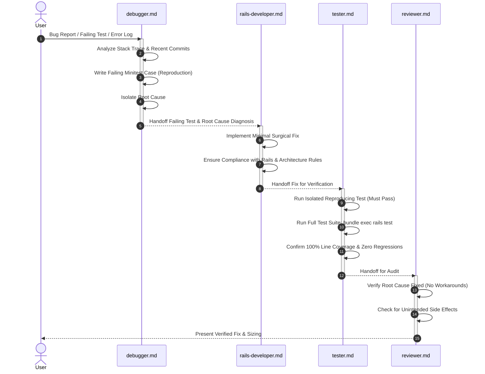

# Workflow: Bugfix & Defect Resolution

This workflow outlines the methodical, test-driven bugfix lifecycle in TimeEcho. It focuses on finding the **true root cause**, reproducing the defect with an automated test first, applying a surgical minimal fix, and preventing regressions.

---

## Workflow Sequence



---

## Phase Details

### Phase 1: Reproduction & Triage (Agent: `debugger.md`)
1. **Analyze Failure Context**:
   - Collect error messages, stack traces, and relevant database state.
   - Inspect recent changes using `git log -n 5` and `git diff`.
2. **Author Reproducing Test**:
   - Write a new test case in the appropriate Minitest file (`test/controllers/`, `test/services/`, etc.) that replicates the exact failure scenario.
   - Run the test to confirm it fails as expected:
     ```bash
     bundle exec rails test test/path/to/test.rb:LINE
     ```

### Phase 2: Root-Cause Fix (Agent: `rails-developer.md`)
1. **Isolate Root Cause**:
   - Differentiate between the symptom and the actual underlying flaw (e.g. timezone mismatch, missing transaction, race condition, or unhandled null).
2. **Apply Surgical Fix**:
   - Implement the minimal necessary change to resolve the root cause.
   - Strictly follow TimeEcho architectural rules:
     - Do not stuff logic into controllers to quick-fix an issue.
     - Do not add ERB comments or controller comments.
     - Respect execution restrictions (never run migrations or servers).

### Phase 3: Verification & Coverage (Agent: `tester.md`)
1. **Verify Fix**: Re-run the reproducing test to ensure it now passes.
2. **Regression Check**: Run the full test suite (`bundle exec rails test`).
3. **Coverage Verification**: Confirm line coverage remains at 100.00% via SimpleCov.

### Phase 4: Review (Agent: `reviewer.md`)
1. **Audit Fix Quality**: Confirm the fix solves the fundamental problem without brittle hacks or regressions.
2. **PR Output**: Provide formatted PR summary adhering to `.github/pull_request_template.md` with appropriate size label (`size/XS` to `size/XL`).

