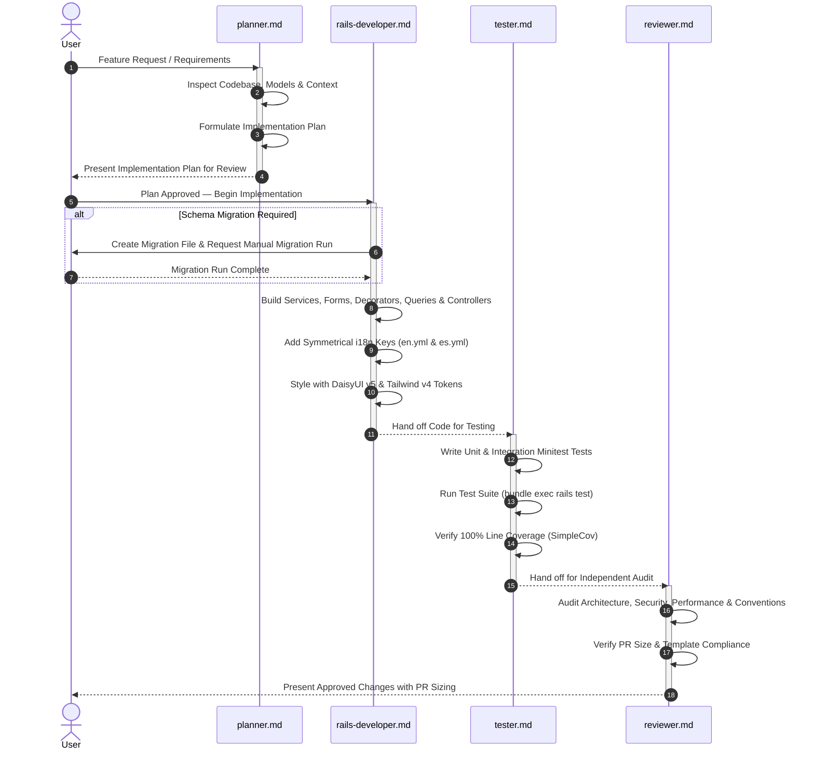

# Workflow: Feature Development

This workflow defines the standard end-to-end lifecycle for implementing new features in TimeEcho. It coordinates the specialized roles of **Planner**, **Rails Developer**, **Tester**, and **Reviewer**.

---

## Workflow Sequence

---

## Phase Details

### Phase 1: Planning (Agent: `planner.md`)
1. **Analyze Requirements**: Clarify the user's objective and map it to TimeEcho domain entities (`Letter`, `EmotionalSnapshot`, `Prediction`, `UserPreference`, etc.).
2. **Review Guidelines**: Check `.ai/rules/rails.md`, `.ai/rules/architecture.md`, `.ai/rules/security.md`.
3. **Draft Plan**: Produce `implementation_plan.md` detailing:
   - Specific files to create, modify, or delete.
   - Transactional boundaries and concurrency row-locks.
   - Verification plan and test cases.
4. **Obtain Approval**: Stop and wait for the user's explicit approval before writing code.

### Phase 2: Implementation (Agent: `rails-developer.md`)
1. **Migrations (if required)**: Create the migration file under `db/migrate/`. **Never run the migration**; instruct the user to run `bundle exec rails db:migrate`.
2. **Domain Logic**:
   - Create single-responsibility services under `app/services/<domain>/`.
   - Create form objects under `app/forms/` for multi-model validations.
   - Encapsulate custom queries in `app/queries/` with `includes` or `eager_load`.
3. **Presentation & Views**:
   - Implement decorators under `app/decorators/` extending `ApplicationDecorator`.
   - Build lightweight ERB views using DaisyUI v5 semantic tokens (`bg-base-100`, `text-primary`).
   - Add translation strings to both `config/locales/en.yml` and `config/locales/es.yml`.
   - Ensure zero comments in ERB files and controllers.

### Phase 3: Testing & Coverage (Agent: `tester.md`)
1. **Write Minitest Cases**:
   - Unit tests for services, forms, decorators, jobs, and mailers.
   - Integration tests for controllers verifying status codes, redirects, sessions, and flash messages.
2. **Run Suite**: Execute `bundle exec rails test`.
3. **Verify Coverage**: Ensure line coverage remains at **100.00%**. If coverage drops, add tests for uncovered branches.

### Phase 4: Independent Review (Agent: `reviewer.md`)
1. **Audit**: Run the 5-point review checklist (`.ai/agents/reviewer.md`).
2. **Security & Performance**: Confirm no N+1 queries, strong parameters in place, and authorization enforced via `LetterPolicy`.
3. **PR Formatting**: Format the pull request description adhering to `.github/pull_request_template.md` and calculate the size label (`size/XS` through `size/XL`).

