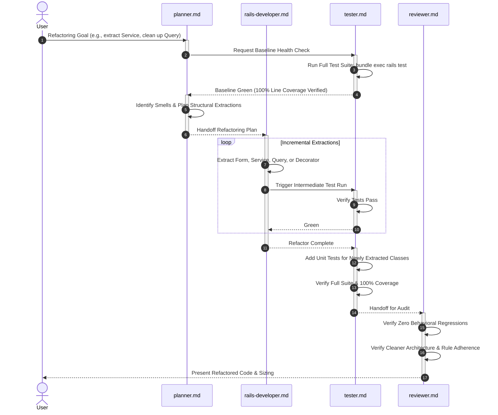

# Workflow: Safe Refactoring

This workflow establishes the protocol for restructuring, optimizing, or modernizing code within TimeEcho without altering its observable behavior.

---

## Workflow Sequence

---

## Phase Details

### Phase 1: Baseline Verification
1. **Confirm Green State**: Run `bundle exec rails test` before making any modifications.
2. **Safety Check**: Refactoring must never begin while tests are failing or coverage is compromised.

### Phase 2: Refactor Planning (Agent: `planner.md`)
1. **Identify Architectural Violations**:
   - Fat controller actions violating the thin-controller standard.
   - Business logic trapped in models or controllers instead of dedicated services.
   - Date or badge presentation logic leaking into ERB templates instead of decorators.
   - Duplicate queries that belong in a Query Object.
2. **Define Boundaries**: Ensure the public interface and external behavior remain identical.

### Phase 3: Incremental Refactoring (Agent: `rails-developer.md`)
1. **Surgical Step-by-Step Extractions**:
   - Extract logic in small, atomic commits.
   - Adhere to the Zero Comments Policy: remove any step comments or layout dividers during the cleanup.
   - Maintain naming conventions and domain namespaces (`Letters::`, `Auth::`, etc.).
2. **Run Tests After Each Step**: Keep the test feedback loop immediate.

### Phase 4: Coverage Maintenance (Agent: `tester.md`)
1. **Unit Test New Abstractions**: Add dedicated unit tests for newly extracted Services, Forms, Queries, or Decorators.
2. **Confirm 100% Line Coverage**: Validate that SimpleCov confirms 100.00% coverage with zero untested lines.

### Phase 5: Independent Review (Agent: `reviewer.md`)
1. **Behavioral Invariance Check**: Confirm that external APIs, views, URLs, and session states are identical.
2. **Architecture Audit**: Verify the refactoring improved readability, modularity, and adherence to `.ai/rules/architecture.md`.
3. **PR Output**: Generate formatted PR summary adhering to `.github/pull_request_template.md`.

