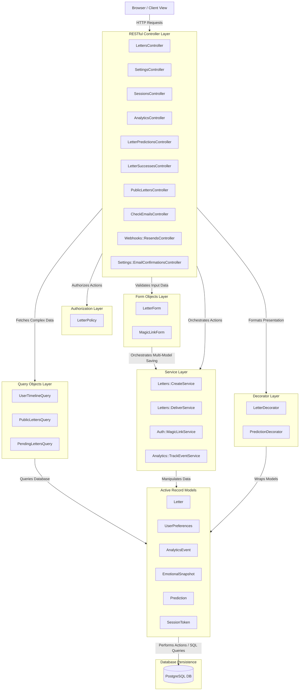
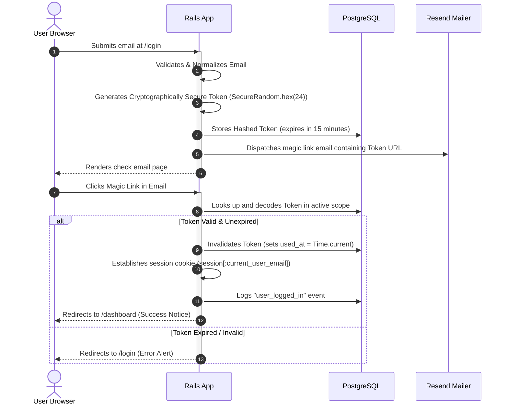
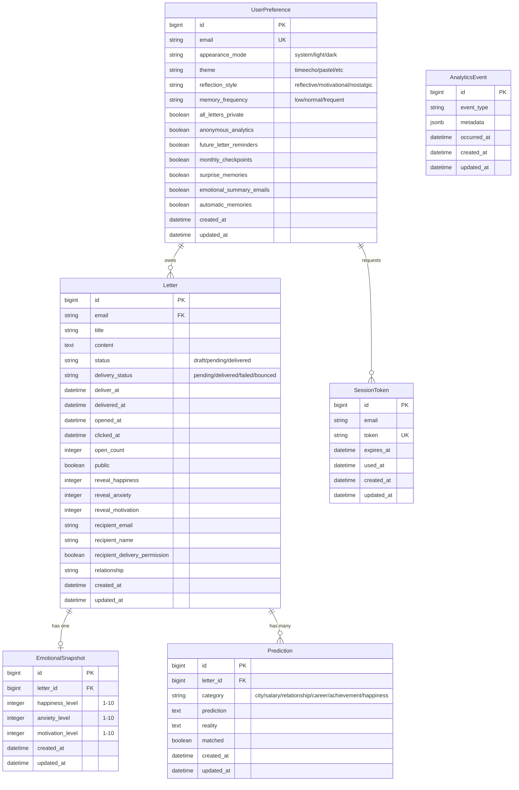
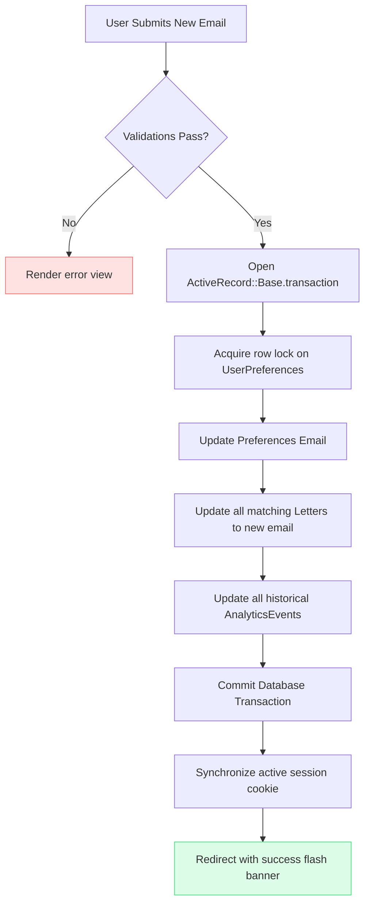
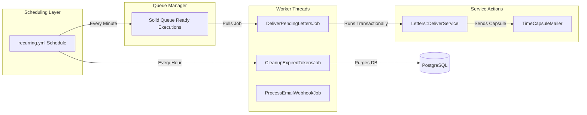

# ⏳ TimeEcho — System Architecture & Design

Welcome to the architectural overview of **TimeEcho**, a premium future-letter digital capsule platform built with **Ruby on Rails 8** and **Tailwind CSS v4 / DaisyUI v5**. 

This document details the layered architectural patterns, data relationships, transactional boundaries, background job execution lifecycles, and the secure authentication flow powering the TimeEcho ecosystem.

---

## 🏛️ 1. Layered Architecture & Architectural Patterns

TimeEcho adopts a highly decoupled, layered architecture built on top of the traditional Model-View-Controller (MVC) paradigm. By isolating business logic, query parameters, presentation formats, authorization checks, and form validations into dedicated layers, the codebase remains clean, testable, and highly maintainable.

### Key Structural Layers:

1. **Model-View-Controller (MVC) & RESTful Controller Design**:
   * **Controllers**: Extremely thin layers strictly focused on the seven standard RESTful actions (`index`, `show`, `new`, `create`, `update`, `destroy`). Any custom collection or member flows are extracted into dedicated, single-responsibility controllers (e.g., `LetterPredictionsController` to update reality states, `Settings::EmailConfirmationsController` to process confirmation links).
   * **Views**: Rendered in English/Spanish (using Rails i18n localization). Powered by Tailwind CSS v4 and DaisyUI v5, using semantic component layout rules.
   * **Models**: Encapsulate basic relationships, validations, and scopes. Heavy business actions are offloaded to Services.

2. **Decorator / Presenter Layer (`app/decorators/`)**:
   * Completely decouples visual presentation logic, custom date formatting, dynamic icons, status pills, and localized conditional class tags from views and database models.
   * **`LetterDecorator`**: Handles letters relative date strings, delivery states, and countdown days left metrics.
   * **`PredictionDecorator`**: Manages prediction category labels, achievement victory badges, and status colors.

3. **Form Objects Layer (`app/forms/`)**:
   * Encapsulate form validation and multi-model record synchronization.
   * **`LetterForm`**: Collects and validates inputs for `Letter`, `EmotionalSnapshot`, and several potential `Prediction` fields in a single schema. It executes the creation inside a single ActiveRecord database transaction.
   * **`MagicLinkForm`**: Validates the email submitted during login.

3. **Service Objects Layer (`app/services/`)**:
   * Encapsulate single-responsibility business operations.
   * **`Letters::CreateService`**: Receives params, validates them via `LetterForm`, and persists the future capsule.
   * **`Letters::DeliverService`**: Transition capsule status, sends the email via `TimeCapsuleMailer`, tracks success/failure analytics, and rollback if errors arise.
   * **`Auth::MagicLinkService`**: Generates, signs, sends, and authenticates cryptographically secure passwordless tokens.
   * **`Analytics::TrackEventService`**: Logs granular user actions to `analytics_events` for retrospection.

4. **Query Objects Layer (`app/queries/`)**:
   * Isolate complex ActiveRecord operations from controllers and models to maintain clean separation of concerns.
   * **`UserTimelineQuery`**: Loads all capsules owned by a user, utilizing eager-loading (`includes(:predictions, :emotional_snapshot)`) to avoid $N+1$ query issues.
   * **`PublicLettersQuery`**: Returns delivered, public letters sorted chronologically.
   * **`PendingLettersQuery`**: Finds letters ready for release, employing high-concurrency database row locking (`FOR UPDATE SKIP LOCKED`).

5. **Policy Layer (`app/policies/`)**:
   * Decouples authorization rules.
   * **`LetterPolicy`**: Implements fine-grained access control rules:
     * Anyone can read a letter if it is marked public and its release date has passed (`delivered`).
     * Only the letter's owner (matching `email`) can view or modify private/pending letters.

---

## 🔑 2. Passwordless Magic Link Authentication Lifecycle

TimeEcho implements a secure, passwordless authentication workflow utilizing single-use, time-sensitive cryptographic access tokens generated on the fly.

---

## 📊 3. Database Schema & Domain Relations

Below is the entity-relationship design showing the relational mapping, attributes, and ownership structures within a user's vault.

---

## 🔄 4. Atomic Transactional Email Migrations & Data Wipeouts

To guarantee absolute transactional integrity and prevent orphaned rows or security breaches, TimeEcho handles sensitive account updates in strict atomic blocks.

### Email Update Transaction
When a user updates their email inside `SettingsController#update`, all associated entities must migrate in tandem to prevent locking out the user from their historical capsules.

### Complete Account Deletion ("Danger Zone" Wipeout)
If a user triggers "Eliminar mi baúl" in their settings, a direct SQLite/PostgreSQL transactional block triggers. This wipes out:
1. All foreign keys (`comments`, `reactions`, `goals`, `predictions`, `emotional_snapshots`) matching the user's `Letter` IDs.
2. The `Letter` records themselves.
3. The `UserPreference` records.
4. Historical `AnalyticsEvent` records matching the user's email inside metadata.
5. All active session contexts are immediately cleared.

---

## ⚙️ 5. Background Job Processing (Solid Queue)

Rails 8 relies on **Solid Queue** as the default Active Job database-backed queue adapter. TimeEcho is configured to leverage Solid Queue for all asynchronous services in both development and production.

### Background System Components:
1. **Recurring Scheduler (`config/recurring.yml`)**:
   * **`DeliverPendingLettersJob`** runs **every minute** to check if any pending capsule is due for delivery.
   * **`CleanupExpiredTokensJob`** runs **every hour** to clean up expired magic-link sessions and spent tokens.
   * **`SolidQueue::Job.clear_finished_in_batches`** runs **every hour** (in production) to prune processed worker logs.
2. **High-Concurrency Locking (`SKIP LOCKED`)**:
   * In `PendingLettersQuery`, letters due for unlock are queried with `.lock("FOR UPDATE SKIP LOCKED")`. This allows multiple active Solid Queue worker threads to run concurrently without duplicate mailing attempts or deadlocking the letters table.
3. **Webhook Ingest Async Pipeline**:
   * When emails are sent via mailer providers (like Resend), delivery events are pushed back to the app via `Webhooks::ResendsController#create`.
   * This payload is immediately offloaded to the background via **`ProcessEmailWebhookJob`** so that the HTTP controller can return a `200 OK` instantaneously, ensuring high-throughput webhook response times.

---

## 🎨 6. Premium Theme System & Styling Tokens

TimeEcho operates on a tailored design system powered by Tailwind CSS v4 and DaisyUI v5. The application achieves its **Calm, Nostalgic, Secure** aesthetic through strict, consistent visual variables.

### Semantic Design Tokens:
* **Typography Hierarchy**:
  * *UI & Body Copy*: Use the geometric **Inter** sans-serif stack exclusively across all views, headers, forms, settings cards, and letter representations. Typographic consistency is crucial to maintaining our high-integrity digital vault aesthetics.
* **Palette Design Rules**:
  * Uses tailored HSL and OkLCH-supported color configurations (avoiding raw hex values) to maintain high contrast standards.
  * Soft dark modes, retro themes (e.g. `pastel`, `autumn`, `luxury`) are dynamically set by reading the `UserPreference#theme` configuration, updating the root page's `data-theme` attribute dynamically.
* **Consistent Shapes**:
  * Standardized white content container cards must always use `rounded-3xl` border-radius shapes, thin border boundaries (`border-slate-100`), and clean micro-shadows (`shadow-2xs`) across all views.

---

## 📱 7. Progressive Web Application (PWA) Setup

To provide a native-app sensation on mobile devices (Android/iOS), TimeEcho is built with native Progressive Web Application capabilities integrated into the Rails layout:
* **`manifest.json.erb`**: Declares app metadata, launcher icons, retro background splash colors, and displays the app in standard `standalone` orientation.
* **`service-worker.js`**: Caches basic static files (fonts, icons, and shell layouts) offline, enabling offline caching and instant boot speeds.
