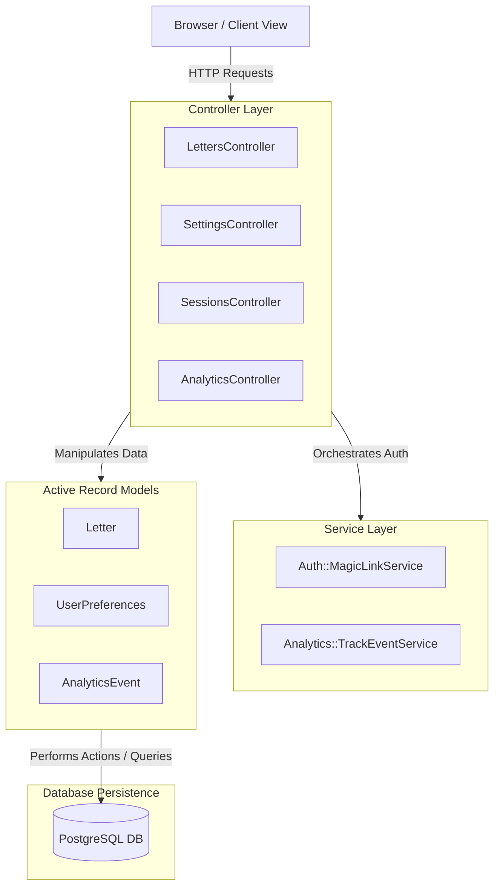
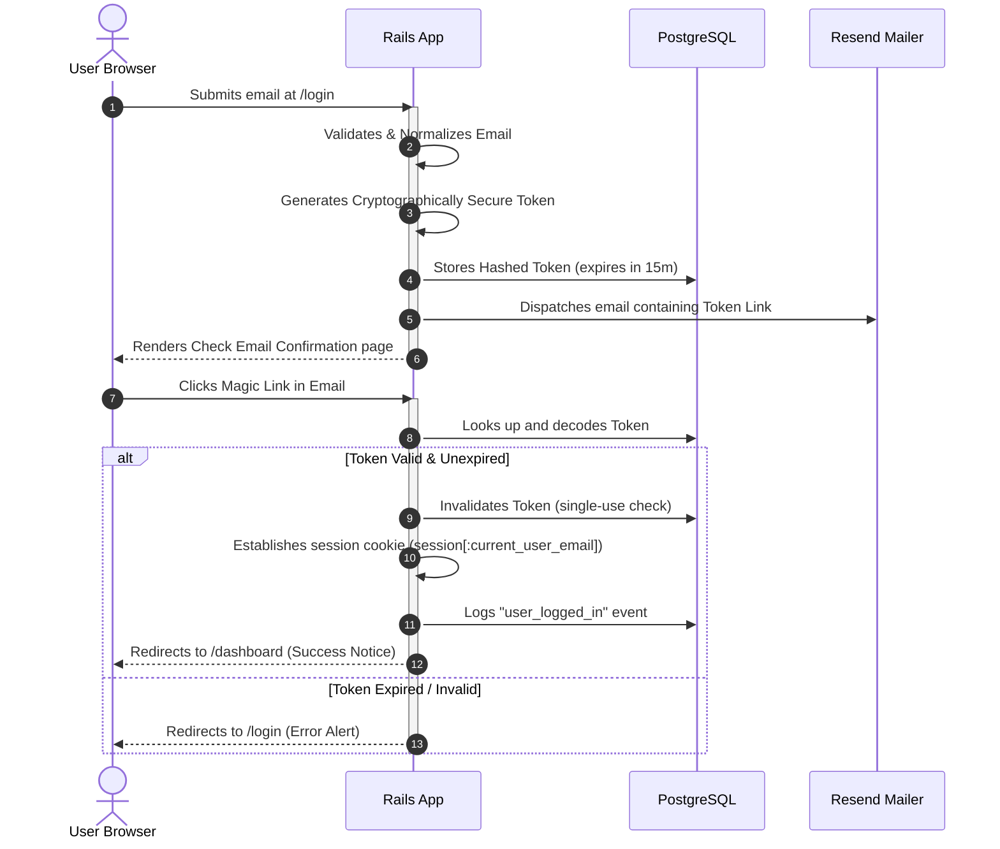
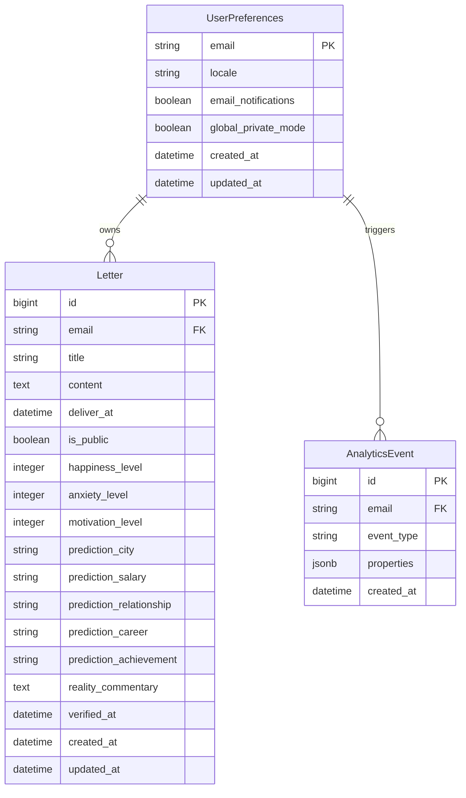
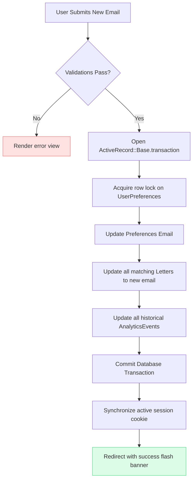

# ⏳ TimeEcho — System Architecture & Design

Welcome to the architectural overview of **TimeEcho**, a premium future-letter digital capsule platform built with **Ruby on Rails 8** and **Tailwind CSS v4 / DaisyUI v5**. 

This document details the core design patterns, data relationships, transactional workflows, and the secure magic-link authentication lifecycle powering the TimeEcho ecosystem.

---

## 🏛️ System Topology

TimeEcho adheres to a strict, highly decoupled **Model-View-Controller (MVC)** pattern supplemented by isolated **Service Objects** (under `app/services/`) for orchestrating cross-cutting business rules (e.g., authentication, analytics, mailings).

---

## 🔑 Secure Magic Link Authentication Lifecycle

TimeEcho is passwordless by design. Authentication is managed via atomic, single-use, time-sensitive access tokens generated on demand and dispatched securely.

---

## 📊 Database Schema & Domain Relations

Below is the entity-relationship layout demonstrating the data boundary of a user's vault.

---

## 🔄 Transactional Data Migration Sequence

When a user migrates their email address inside `SettingsController#update`, TimeEcho executes a high-integrity, atomic Postgres transaction to preserve historical integrity, transfer entity ownership, and update active session markers in a single transaction step.

---

## 🎨 Premium Style System Tokens (Tailwind v4 / DaisyUI v5)

TimeEcho operates on a tailored typographic and visual system, giving it a nostalgic, premium journal aesthetic.

### Typography Hierarchy
* **Main Headlines & Card Headers**: `font-serif italic text-primary` using **Instrument Serif** to convey elegance and memory preservation.
* **Secondary Action Labels & Metas**: `font-sans uppercase text-[10px] tracking-wider font-semibold` using **Inter** to maximize structural legibility.

### Semantic Color Design Rules
1. **Never use hardcoded hex codes** (e.g. `#5b21b6` is strictly replaced with `@theme` brand variables).
2. **Standardized Radii**: Standard components are locked into `rounded-xl` or `rounded-2xl` shapes; over-rounded shapes (`rounded-3xl`) are explicitly forbidden.
3. **Contrast Compliance**: Contrast ratios strictly respect WCAG AA guidelines by leveraging soft theme-neutral values and OKLCH color spaces.
