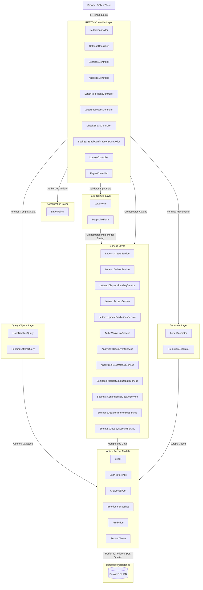
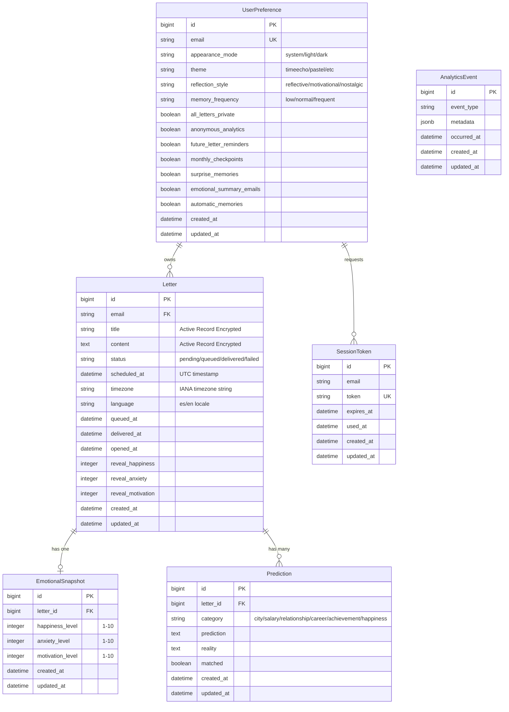
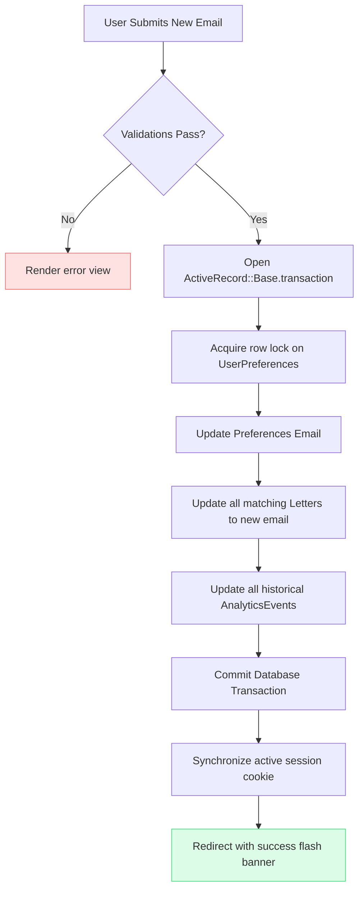
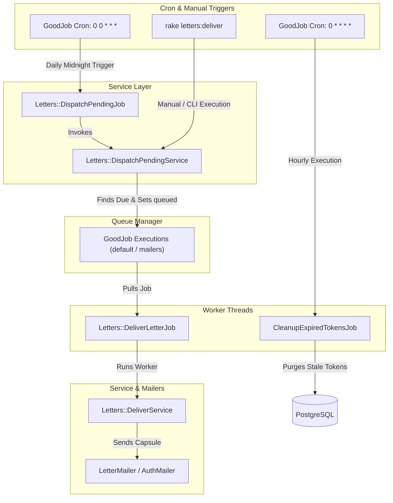

# ⏳ TimeEcho — System Architecture & Design

Welcome to the architectural overview of **TimeEcho**, a premium future-letter digital capsule platform built with **Ruby on Rails 8** and **Tailwind CSS v4 / DaisyUI v5**.

This document details the layered architectural patterns, data relationships, transactional boundaries, background job execution lifecycles, and the secure authentication flow powering the TimeEcho ecosystem.

---

## 🏛️ 1. Layered Architecture & Architectural Patterns

TimeEcho adopts a highly decoupled, layered architecture built on top of the traditional Model-View-Controller (MVC) paradigm. By isolating business logic, query parameters, presentation formats, authorization checks, and form validations into dedicated layers, the codebase remains clean, testable, and highly maintainable.



### Key Structural Layers:

1. **Model-View-Controller (MVC) & RESTful Controller Design**:
   - **Controllers**: Extremely thin layers strictly focused on the seven standard RESTful actions (`index`, `show`, `new`, `create`, `update`, `destroy`). Any custom collection or member flows are extracted into dedicated, single-responsibility controllers (e.g., `LocalesController` for session-persisted locale selection, `LetterPredictionsController` to update reality states, `Settings::EmailConfirmationsController` to process confirmation links, `PagesController` for landing and static info pages).
   - **Views**: Rendered in English/Spanish (using Rails i18n localization). Powered by Tailwind CSS v4 and DaisyUI v5, using semantic component layout rules.
   - **Models**: Encapsulate basic relationships, validations, and scopes. Heavy business actions are offloaded to Services.

2. **Decorator / Presenter Layer (`app/decorators/`)**:
   - Completely decouples visual presentation logic, custom date formatting, dynamic icons, status pills, and localized conditional class tags from views and database models.
   - **`LetterDecorator`**: Handles letters relative date strings, delivery states, countdown days left metrics, and localized title resolution.
   - **`PredictionDecorator`**: Manages prediction category labels, achievement victory badges, and status colors.

3. **Form Objects Layer (`app/forms/`)**:
   - Encapsulate form validation and multi-model record synchronization.
   - **`LetterForm`**: Collects and validates inputs for `Letter`, `EmotionalSnapshot`, and several potential `Prediction` fields in a single schema. It executes the creation inside a single ActiveRecord database transaction with IANA timezone conversion.
   - **`MagicLinkForm`**: Validates the email submitted during login.

4. **Service Objects Layer (`app/services/`)**:
   - Encapsulate single-responsibility business operations across domain namespaces:
   - **`Letters::CreateService`**: Receives params, validates them via `LetterForm`, and persists the future capsule.
   - **`Letters::DeliverService`**: Transitions capsule status (`pending` -> `queued` -> `delivered`/`failed`), sends the email via `LetterMailer`, tracks success/failure analytics, and rolls back if errors arise.
   - **`Letters::DispatchPendingService`**: Finds due pending capsules and enqueues deliver jobs into GoodJob.
   - **`Letters::AccessService`**: Handles authorization access logic for private letter retrieval.
   - **`Letters::UpdatePredictionsService`**: Updates reality reflections and match states for delivered predictions.
   - **`Auth::MagicLinkService`**: Generates, signs, sends, and authenticates cryptographically secure passwordless tokens.
   - **`Analytics::TrackEventService`**: Logs granular user actions to `analytics_events` for retrospection.
   - **`Analytics::FetchMetricsService`**: Aggregates retrospective dashboard metrics (capsule counts, emotional baselines, prediction match ratios).
   - **`Settings::RequestEmailUpdateService`**: Dispatches email address update confirmation magic links.
   - **`Settings::ConfirmEmailUpdateService`**: Atomically updates user email address across preferences, letters, and events.
   - **`Settings::UpdatePreferencesService`**: Updates user appearance mode, theme, reflection style, and notification preferences.
   - **`Settings::DestroyAccountService`**: Atomically purges all user records ("Danger Zone" account deletion).

5. **Query Objects Layer (`app/queries/`)**:
   - Isolate complex ActiveRecord operations from controllers and models to maintain clean separation of concerns.
   - **`UserTimelineQuery`**: Loads all capsules owned by a user, utilizing eager-loading (`includes(:predictions, :emotional_snapshot)`) to avoid $N+1$ query issues.
   - **`PendingLettersQuery`**: Finds letters ready for release, employing high-concurrency database row locking (`FOR UPDATE SKIP LOCKED`).

6. **Policy Layer (`app/policies/`)**:
   - Decouples authorization rules.
   - **`LetterPolicy`**: Implements fine-grained access control rules:
     - Letters are strictly private digital capsules locked to their creator (`user_email.present? && letter.email == user_email`).

---

## 🔑 2. Passwordless Magic Link Authentication Lifecycle

TimeEcho implements a secure, passwordless authentication workflow utilizing single-use, time-sensitive cryptographic access tokens generated on the fly.

```mermaid
sequenceDiagram
    autonumber
    actor User as User Browser
    participant App as Rails App
    participant DB as PostgreSQL
    participant SMTP as Resend Mailer

    User->>App: Submits email at /login
    activate App
    App->>App: Validates & Normalizes Email
    App->>App: Generates Cryptographically Secure Token (SecureRandom.hex(24))
    App->>DB: Stores Hashed Token (expires in 15 minutes)
    App->>SMTP: Dispatches magic link email containing Token URL
    App-->>User: Renders check email page
    deactivate App

    User->>App: Clicks Magic Link in Email
    activate App
    App->>DB: Looks up and decodes Token in active scope
    alt Token Valid & Unexpired
        App->>DB: Invalidates Token (sets used_at = Time.current)
        App->>App: Establishes session cookie (session[:current_user_email])
        App->>DB: Logs "user_logged_in" event
        App-->>User: Redirects to /dashboard (Success Notice)
    else Token Expired / Invalid
        App-->>User: Redirects to /login (Error Alert)
    end
    deactivate App
```



---

## 📊 3. Database Schema & Domain Relations

Below is the entity-relationship design showing the relational mapping, attributes, and ownership structures within a user's vault.



> [!SECURITY]
> **Active Record Encryption**: Letter titles (`encrypts :title`) and letter body content (`encrypts :content`) are encrypted at rest using Rails Active Record Encryption. Keys are configured via environment variables (`ACTIVE_RECORD_ENCRYPTION_PRIMARY_KEY`, `ACTIVE_RECORD_ENCRYPTION_DETERMINISTIC_KEY`, `ACTIVE_RECORD_ENCRYPTION_KEY_DERIVATION_SALT`).

---

## 🔄 4. Atomic Transactional Email Migrations & Data Wipeouts

To guarantee absolute transactional integrity and prevent orphaned rows or security breaches, TimeEcho handles sensitive account updates in strict atomic blocks.

### Email Update Transaction

When a user updates their email inside `SettingsController#update`, all associated entities must migrate in tandem to prevent locking out the user from their historical capsules.



### Complete Account Deletion ("Danger Zone" Wipeout)

If a user triggers "Eliminar mi baúl" in their settings, a direct PostgreSQL transactional block (`Settings::DestroyAccountService`) triggers. This wipes out:

1. All foreign keys (`predictions`, `emotional_snapshots`) matching the user's `Letter` IDs.
2. The `Letter` records themselves.
3. The `UserPreference` records.
4. Historical `AnalyticsEvent` records matching the user's email inside metadata.
5. All active session contexts are immediately cleared.

---

## ⚙️ 5. Background Job Processing (GoodJob)

Rails 8 uses **GoodJob** as the database-backed Active Job queue adapter. TimeEcho is configured to leverage GoodJob for all asynchronous services in both development and production.



### Background System Components:

1. **Daily Automated Dispatch Job (`Letters::DispatchPendingJob`)**:
   - Runs **daily at midnight (`0 0 * * *`)** via GoodJob cron. Triggers `Letters::DispatchPendingService` to query due pending capsules (`scheduled_at <= Time.current`), update status to `"queued"`, and enqueue `Letters::DeliverLetterJob` worker jobs into GoodJob.
2. **Manual/CLI Rake Task (`rake letters:deliver`)**:
   - Provides a standalone CLI entry point that invokes `Letters::DispatchPendingService` directly, useful for on-demand execution or external scheduler triggers.
3. **Resilient Delivery Worker (`Letters::DeliverLetterJob`)**:
   - Processes individual letter deliveries via `Letters::DeliverService`. Configured with `retry_on` using polynomial backoff to handle transient network timeouts or third-party email API hiccups without data loss, updating status to `delivered` or `failed`.
4. **Hourly Cron (`CleanupExpiredTokensJob`)**:
   - Runs **every hour (`0 * * * *`)** via GoodJob cron to clean up expired magic-link sessions and spent tokens.
5. **High-Concurrency Locking (`SKIP LOCKED`)**:
   - In `PendingLettersQuery`, letters due for unlock are queried with `.lock("FOR UPDATE SKIP LOCKED")`. This allows concurrent workers to process without duplicate mailing attempts or deadlocking the letters table.

---

## 🎨 6. Premium Theme System & Styling Tokens

TimeEcho operates on a tailored design system powered by Tailwind CSS v4 and DaisyUI v5. The application achieves its **Calm, Nostalgic, Secure** aesthetic through strict, consistent visual variables.

### Semantic Design Tokens:

- **Typography Hierarchy**:
  - _UI & Body Copy_: Use the geometric **Inter** sans-serif stack exclusively across all views, headers, forms, settings cards, and letter representations. Typographic consistency is crucial to maintaining our high-integrity digital vault aesthetics.
- **Palette Design Rules**:
  - Uses tailored HSL and OkLCH-supported color configurations (avoiding raw hex values) to maintain high contrast standards.
  - Soft dark modes, retro themes (e.g. `pastel`, `autumn`, `luxury`) are dynamically set by reading the `UserPreference#theme` configuration, updating the root page's `data-theme` attribute dynamically.
- **Consistent Shapes**:
  - Standardized white content container cards must always use `rounded-3xl` border-radius shapes, thin border boundaries (`border-slate-100`), and clean micro-shadows (`shadow-2xs`) across all views.

---

## 📱 7. Progressive Web Application (PWA) Setup

To provide a native-app sensation on mobile devices (Android/iOS), TimeEcho is built with native Progressive Web Application capabilities integrated into the Rails layout:

- **`manifest.json.erb`**: Declares app metadata, launcher icons, retro background splash colors, and displays the app in standard `standalone` orientation.
- **`service-worker.js`**: Caches basic static files (fonts, icons, and shell layouts) offline, enabling offline caching and instant boot speeds.

---

## 🌐 8. Internationalization (i18n) Architecture

TimeEcho implements a lightweight, two-locale internationalization system using Rails' built-in `I18n` framework. The architecture prioritizes explicit locale control, graceful fallbacks, and clean separation between view templates and translated strings.

### 8.1 Locale Configuration

The application's locale settings are configured in `config/application.rb`:

```ruby
config.i18n.available_locales = [ :es, :en ]
config.i18n.default_locale = :en
```

- **Allowed locales**: Only `:es` (Spanish) and `:en` (English) are permitted. Any other locale requested by the browser is rejected and falls back to the default.
- **Default locale**: `:en` (English) serves as both the default UI language and the ultimate fallback for unsupported locales or missing translations.
- **Fallbacks**: Enabled in `config/environments/production.rb` and `config/environments/test.rb` via `config.i18n.fallbacks = true`. When `fallbacks = true`, any missing key in a locale falls back to the `default_locale` rather than rendering the raw key name.

### 8.2 Locale Resolution & Session Toggling (`set_locale`)

Locale resolution is handled by the `set_locale` before_action in `ApplicationController`. It supports both explicit user selection (persisted across sessions via `LocalesController`) and automatic browser header detection:

```mermaid
flowchart TD
    A[Request received] --> B{session[:locale] present & valid?}
    B -- Yes --> C[Set I18n.locale to session locale]
    B -- No --> D{HTTP_ACCEPT_LANGUAGE present?}
    D -- No --> E[Locale unchanged, uses default]
    D -- Yes --> F[Extract 2-letter browser locale]
    F --> G{Locale in [:es, :en]?}
    G -- Yes --> H[Set I18n.locale to browser locale]
    G -- No --> E
```

| Source | Input Value | Supported? | Resulting Locale |
| ------ | ----------- | ---------- | ---------------- |
| Session | `session[:locale] = "es"` | Yes | `:es` |
| Session | `session[:locale] = "en"` | Yes | `:en` |
| Browser Header | `HTTP_ACCEPT_LANGUAGE: "es-ES,es;q=0.9"` | Yes | `:es` |
| Browser Header | `HTTP_ACCEPT_LANGUAGE: "en-US,en;q=0.9"` | Yes | `:en` |
| Browser Header | `HTTP_ACCEPT_LANGUAGE: "fr-FR,fr;q=0.9"` | No | `:en` (default, unchanged) |
| None | (no session, no header) | No | `:en` (default, unchanged) |

### 8.3 LocalesController & Navigation Toggle

Users can switch languages on the fly from the navigation bar. The toggle button uses the `toggle_locale` helper to submit to `LocalesController`:

- `POST /locales?locale=es` / `POST /locales?locale=en`: Writes `params[:locale]` to `session[:locale]` and redirects back to the previous page.
- `DELETE /locales/:id`: Clears `session[:locale]` to return to browser auto-detection.

### 8.4 Test Locale Strategy

The test suite establishes `I18n.locale = :es` globally in `test/test_helper.rb` via a `setup` block on `ActiveSupport::TestCase`. Because test requests do not send an `Accept-Language` header or a preset session locale by default, the `set_locale` before_action does not override this pre-set Spanish locale, ensuring all assertions match Spanish text expectations.

```ruby
# test/test_helper.rb
class TestCase
  setup { I18n.locale = :es }
end
```

The `ApplicationControllerTest` and `LocalesControllerTest` cover session persistence, language toggling, and fallback behavior across supported (`es`, `en`) and unsupported (`fr`) headers.

### 8.5 Decorator Integration & Title Localization

All locale-dependent formatting (dates, status badges, category labels, countdown strings) is encapsulated in decorators within `app/decorators/`:

- **LetterDecorator**: `display_title` (translates default `"your_letter"` / localized title placeholders dynamically based on `I18n.locale`), `formatted_created_at`, `formatted_delivered_at`, `days_left_text`, `status_badge`.
- **PredictionDecorator**: `category_label`, `result_badge`.

### 8.6 View Text Policy

All user-facing strings in ERB views must use `t()` calls — no hardcoded Spanish or English text is permitted. HTML comments in views should be in English for consistency.

---

## 🚀 9. Production Deployment Architectures

TimeEcho supports two modern production deployment workflows designed for reliability and low resource overhead:

### 9.1 Render Web Service (PaaS)

Automated deployment configured through `render.yaml` and `bin/render-build.sh`:

- **Build Pipeline**: Installs gems, installs npm packages, compiles Tailwind CSS (`npm run build:css`), precompiles assets (`assets:precompile`), and applies database migrations.
- **Single-Mode Puma**: Optimized for entry-level container RAM (512MB) by enforcing `WEB_CONCURRENCY=0` and `RAILS_MAX_THREADS=3`.
- **In-Process GoodJob**: Operates with `GOOD_JOB_EXECUTION_MODE=async`, allowing background delivery workers and cron schedules (`Letters::DispatchPendingJob`, `CleanupExpiredTokensJob`) to execute reliably inside the web process without incurring the cost of a standalone worker instance.

### 9.2 Kamal Container Deployment (IaaS / Bare Metal)

Turnkey container deployment configured in `config/deploy.yml`:

- Leverages the multi-stage Docker build (`Dockerfile`) to create a minimal, hardened production image.
- Supports rolling zero-downtime updates, asset volume management, and direct integration with managed PostgreSQL and Resend transactional email.

